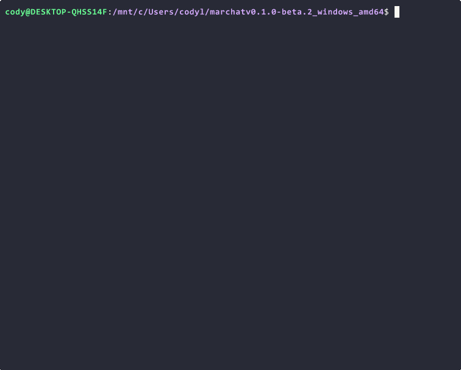

# marchat 🧃

[](https://github.com/Cod-e-Codes/marchat/actions/workflows/go.yml)
[](LICENSE)
[](https://github.com/Cod-e-Codes/marchat)
[](https://go.dev/dl/)
[](https://developers.cloudflare.com/cloudflare-one/connections/connect-apps/install-and-setup/installation/)

## Table of Contents

- [Beta Release](#beta-release)
- [Features](#features)
- [Quick Start](#quick-start)
- [Usage](#usage)
- [Project Structure](#project-structure)
- [Admin Mode](#admin-mode-privileged-commands--security)
- [Security](#security)
- [Tech Stack](#tech-stack)
- [Troubleshooting](#troubleshooting)
- [Contributing & Feedback](#contributing--feedback)
- [What's Next](#whats-next)
- [License](#license)

---

## What is this?

`marchat` is a minimalist terminal-based group chat app for real-time conversations — currently in beta, with encryption, plugins, and Docker support coming in v1.

It runs entirely on a local SQLite database with no external services required — unless remote access is desired, which will be supported natively in v1.

## Why marchat?

Built for father-son coding sessions, marchat is about sharing the joy of hacking, learning, and chatting in a terminal. It's a fun, retro-inspired project for anyone who loves the command line, real-time collaboration, or just wants a simple, self-hosted chat.




---

## Beta Release

`marchat` is currently in a pre-release phase with version `v0.1.0-beta.2`. This is the second public beta release, featuring prebuilt binaries for Linux, Windows, and macOS. The release includes both `marchat-server` and `marchat-client` executables, allowing you to test the application without building from source. This release includes clipboard support and bug fixes from `v0.1.0-beta.1`.

> [!IMPORTANT]
> This is a beta release intended for early testing and feedback. While stable for general use, some features may change or be refined before the first stable release. Please share your feedback in [GitHub Discussions](https://github.com/Cod-e-Codes/marchat/discussions), or report bugs on the [GitHub Issues page](https://github.com/Cod-e-Codes/marchat/issues).

### Installing the Beta Release

1. **Download the binaries**:
   - Visit the [v0.1.0-beta.2 release page](https://github.com/Cod-e-Codes/marchat/releases/tag/v0.1.0-beta.2).
   - Download the appropriate archive for your platform (Linux, Windows, or macOS).
   - Extract the archive to a directory of your choice.

2. **Run the server**:
   ```sh
   ./marchat-server
   ```
   - Optionally, start the server with admin privileges:
     ```sh
     ./marchat-server --admin YourName --admin-key your-admin-key
     ```

3. **Run the client**:
   ```sh
   # Linux/macOS
   ./marchat-client --username Cody --theme patriot --server ws://localhost:8080/ws

   # Windows
   marchat-client.exe --username Cody --theme patriot --server ws://localhost:8080/ws
   ```
   - Alternatively, use a `config.json` file (see [Quick Start](#quick-start) for details).

> [!NOTE]
> For the beta release, we recommend using the prebuilt binaries (`marchat-server` and `marchat-client`) instead of building from source. The binaries are standalone and include all dependencies.

> [!IMPORTANT]
> Launch these executables from a terminal—don’t double-click. Double-clicking produces no visible output and can leave a server running unnoticed on your network.

> [!TIP]
> To provide feedback on the beta release, share your thoughts in [GitHub Discussions](https://github.com/Cod-e-Codes/marchat/discussions). Found a bug? Create an issue on the [GitHub Issues page](https://github.com/Cod-e-Codes/marchat/issues) with your platform details and steps to reproduce. Check the [Full Changelog](https://github.com/Cod-e-Codes/marchat/commits/v0.1.0-beta.2) for details on what's included in this release.

---

## Features

- **Terminal UI (TUI):** Beautiful, scrollable chat using [Bubble Tea](https://github.com/charmbracelet/bubbletea)
- **Real-time WebSocket Chat:** Fast, robust, and cross-platform server/client
- **Themes:** Choose from `patriot`, `retro`, or `modern` for a unique look
- **Small File Sharing (<1MB):** Instantly send and receive small files with `:sendfile <path>` and save them with `:savefile <filename>`
- **Emoji Support:** Auto-converts common ASCII emoji (e.g., `:)`, `:(`, `:D`, `<3`, `:P`) to Unicode
- **Live User List:** See who’s online in a fixed-width, styled panel (up to 20 users shown)
- **@Mention Highlighting:** Messages with `@username` highlight for all users in the chat
- **Clipboard Support:** Copy (`Ctrl+C`), paste (`Ctrl+V`), cut (`Ctrl+X`), and select all (`Ctrl+A`) in the textarea
- **Admin Mode:** Privileged commands (like `:cleardb`) for authenticated admins only
- **Message Cap:**
  - Only the last 100 messages are kept in memory for client performance
  - The server database automatically caps messages at 1000; oldest messages are deleted to make room for new ones
- **Configurable:** Set username, server URL, and theme via config file or flags
- **Graceful Shutdown:** Clean exit and robust connection handling (ping/pong heartbeat)
- **ASCII Art Banner:** Server displays a beautiful banner with connection info on startup

---

## Prerequisites

- **Supported Platforms**: Linux, Windows, and macOS (amd64/x86_64 architecture only)
- Install [Go 1.23+](https://go.dev/dl/) if you haven't already (only needed if building from source)
  - *(Check with `go version` in your terminal)*
  - **Minimum Version**: Go 1.23.0 required for charmbracelet dependencies
- (Optional, for remote access) Download [cloudflared](https://developers.cloudflare.com/cloudflare-one/connections/connect-apps/install-and-setup/installation/) (`cloudflared.exe` on Windows)
- (Optional, for clipboard support on Linux) Install `xclip` or `xsel` for `github.com/atotto/clipboard` functionality

## Quick Start

> [!NOTE]
> You can configure marchat via flags or a `config.json`. Flags override config file values. For the beta release, use the prebuilt binaries as described in [Beta Release](#beta-release).

### 1. Clone the repo (if building from source)
```sh
git clone https://github.com/Cod-e-Codes/marchat.git
cd marchat
```

### 2. Install Go dependencies (if building from source)
```sh
go mod tidy
```

### 3. Build the project (if building from source)
```sh
go build ./...
```

### 3.5. Make binaries executable (Linux/macOS only)
```sh
chmod +x marchat-server marchat-client
```

> [!NOTE]
> On Windows, the `.exe` extension automatically makes files executable. This step is only needed on Linux and macOS.

### 4. Configure the server

marchat supports multiple configuration methods. Choose one of the following approaches:

#### Option A: Environment Variables (Recommended)
Set environment variables directly:

```sh
export MARCHAT_PORT=8080
export MARCHAT_ADMIN_KEY=your-secret-admin-key
export MARCHAT_USERS=Cody,Crystal,Alice  # No spaces between usernames
export MARCHAT_CONFIG_DIR=/path/to/config  # Optional: custom config directory
```

#### Option B: .env File
Create a `.env` file in your config directory:

```sh
# Copy the example file
cp env.example .env

# Edit the .env file with your settings
MARCHAT_PORT=8080
MARCHAT_ADMIN_KEY=your-secret-admin-key
MARCHAT_USERS=Cody,Crystal,Alice  # No spaces between usernames
MARCHAT_DB_PATH=./config/marchat.db
MARCHAT_LOG_LEVEL=info
```

#### Option C: Legacy JSON Config (Deprecated)
Create `server_config.json` in the project root or config directory:
```json
{
  "port": 8080,
  "admins": ["Cody", "Crystal"],
  "admin_key": "your-admin-key"
}
```

> [!NOTE]
> Environment variables take precedence over .env files, which take precedence over JSON config files. The `--config-dir` flag can be used to specify a custom configuration directory.

### 5. Run the server (port 8080, WebSocket)
Using the prebuilt binary:
```sh
./marchat-server
```
Or, if building from source:
```sh
go run cmd/server/main.go
```

You can also specify a custom config directory:
```sh
./marchat-server --config-dir /path/to/config
```

> [!TIP]
> The server will automatically create the config directory if it doesn't exist. In development mode, it defaults to `./config`. In production, it uses `$XDG_CONFIG_HOME/marchat`.
> 
> **Note**: The `config/` directory is tracked in git but its contents are ignored to prevent sensitive configuration files from being committed. The server will create the directory and any necessary files on startup.

### 6. (Optional) Create a client config file
Create `config.json` in the project root:
```json
{
  "username": "Cody",
  "server_url": "ws://localhost:8080/ws",
  "theme": "patriot",
  "twenty_four_hour": true
}
```

> [!NOTE]
> If no `config.json` is found, the client uses default values. Specify a custom config path with `--config`.

### 7. Run the client
Using the prebuilt binary:
```sh
# Linux/macOS
./marchat-client --username Cody --theme patriot --server ws://localhost:8080/ws

# Windows
marchat-client.exe --username Cody --theme patriot --server ws://localhost:8080/ws
```
Or, if building from source:
```sh
go run client/main.go --username Cody --theme patriot --server ws://localhost:8080/ws
```
Or with a config file:
```sh
./marchat-client --config config.json
```

> [!IMPORTANT]
> Ensure the server URL uses `ws://` for local development or `wss://` for production (secure WebSocket).

---

## Docker Configuration

marchat includes Docker support with environment-based configuration and enhanced security features:

### Security Features

> [!IMPORTANT]
> The Docker container runs as a non-root user (`marchat`) for enhanced security. The container includes build arguments for customizing user/group ownership to prevent volume permission issues.

**Key Security Improvements:**
- **Non-root Execution**: Container runs as user `marchat` instead of root
- **Custom User/Group IDs**: Build arguments `USER_ID` and `GROUP_ID` allow matching host user permissions
- **Permission Management**: Entrypoint script automatically fixes config directory ownership
- **Minimal Attack Surface**: Uses Alpine Linux with minimal required packages

### Using Docker Compose

#### Basic Usage
```sh
# Start the service
docker-compose up -d

# View logs
docker-compose logs -f marchat

# Stop the service
docker-compose down
```

#### Custom User/Group IDs (Recommended for Production)
To avoid permission issues with mounted volumes, build with your host user's UID/GID:

```sh
# Build with custom user/group IDs
docker-compose build --build-arg USER_ID=$(id -u) --build-arg GROUP_ID=$(id -g)

# Or set environment variables
USER_ID=$(id -u) GROUP_ID=$(id -g) docker-compose up -d
```

**Windows PowerShell:**
```powershell
# Get current user SID and convert to UID (typically 1000 for first user)
docker-compose build --build-arg USER_ID=1000 --build-arg GROUP_ID=1000
```

### Container Architecture

**Entrypoint Script (`entrypoint.sh`):**
- Automatically fixes config directory ownership at container startup
- Ensures `/marchat/config` has correct permissions for the `marchat` user
- Gracefully handles permission errors without failing container startup
- Executes the main application with proper signal handling

**Config Directory Structure:**
- **Container Path**: `/marchat/config` (set via `MARCHAT_CONFIG_DIR` environment variable)
- **Host Mount**: `./config:/marchat/config` (configurable in docker-compose.yml)
- **Database**: Stored at `/marchat/config/marchat.db` inside container

### Custom Configuration with Docker

You can customize the configuration through multiple methods:

1. **Environment Variables**: Modify the `environment` section in `docker-compose.yml`
2. **Mount a .env file**: Uncomment the `env_file` section in `docker-compose.yml`
3. **Custom Config Directory**: Mount your config directory:
   ```yaml
   volumes:
     - ./my-config:/marchat/config
   ```
4. **Custom User/Group IDs**: Override build arguments for different permission models:
   ```yaml
   build:
     context: .
     args:
       USER_ID: 1001
       GROUP_ID: 1001
   ```

### Environment Variables Reference

| Variable | Default | Description |
|----------|---------|-------------|
| `MARCHAT_PORT` | `8080` | Server port (consistent across all Docker configurations) |
| `MARCHAT_ADMIN_KEY` | (required) | Admin authentication key |
| `MARCHAT_USERS` | (required) | Comma-separated admin usernames |
| `MARCHAT_DB_PATH` | `/marchat/config/marchat.db` | Database file path |
| `MARCHAT_LOG_LEVEL` | `info` | Log level (debug, info, warn, error) |
| `MARCHAT_JWT_SECRET` | (auto-generated) | JWT secret for authentication |
| `MARCHAT_CONFIG_DIR` | `/marchat/config` | Config directory path inside container |

### Production Best Practices

**Security Recommendations:**
- Change the default `MARCHAT_ADMIN_KEY` from `changeme` to a secure value
- Use custom `MARCHAT_JWT_SECRET` for production deployments
- Consider using Docker secrets for sensitive environment variables
- Regularly update the base Alpine Linux image for security patches

**Permission Management:**
- Use `USER_ID` and `GROUP_ID` build arguments to match your host user
- Ensure the host config directory has appropriate permissions
- Monitor container logs for permission-related warnings

**Volume Management:**
- Use named volumes for persistent data: `marchat_data:/marchat/config`
- Consider backing up the config directory regularly
- Test volume permissions in your specific environment

### Troubleshooting Docker Issues

**Permission Denied Errors:**
```sh
# Check container user
docker-compose exec marchat id

# Verify config directory permissions
docker-compose exec marchat ls -la /marchat/config

# Rebuild with correct UID/GID
docker-compose build --no-cache --build-arg USER_ID=$(id -u) --build-arg GROUP_ID=$(id -g)
```

**Port Conflicts:**
- Ensure port 8080 is available on your host
- Check for other services using the same port
- Verify firewall settings allow the connection

**Configuration Issues:**
- Verify environment variables are set correctly
- Check that the config directory is properly mounted
- Review container logs for configuration errors

---

## Remote Access (Optional)

If you want to make your marchat server accessible from outside your local network (e.g., to chat with friends remotely), use [Cloudflare Tunnel](https://developers.cloudflare.com/cloudflare-one/connections/connect-apps/).

### 1. Download cloudflared
- [Get cloudflared for your OS](https://developers.cloudflare.com/cloudflare-one/connections/connect-apps/install-and-setup/installation/)

### 2. Start a tunnel to your local server
```sh
cloudflared tunnel --url http://localhost:8080
```

> [!TIP]
> Cloudflare provides a public `https://` URL. Convert it to `wss://.../ws` for the client (e.g., `https://bold-forest-cat.trycloudflare.com` becomes `wss://bold-forest-cat.trycloudflare.com/ws`).

### 3. Update your client config
```sh
./marchat-client --username Cody --admin --admin-key your-admin-key --server wss://bold-forest-cat.trycloudflare.com/ws
```

> [!NOTE]
> Temporary tunnels don’t require a Cloudflare account. For persistent tunnels, see the [Cloudflare Tunnel docs](https://developers.cloudflare.com/cloudflare-one/connections/connect-apps/).

> [!IMPORTANT]
> Always run `marchat-server` and `marchat-client` from a terminal (shell), not by double-clicking. If you double-click, nothing will appear and the server may be left running silently in the background, potentially exposing a port you didn’t intend.

---

## Usage

Interact with marchat using the following commands and features:

> [!TIP]
> All marchat commands start with a colon (`:`) and are case-sensitive. Commands are processed when you press `Enter`.

- **Send messages**: Type and press `Enter`.
- **File sharing**:
  - Send files (<1MB): `:sendfile <path>`
  - Save received files: `:savefile <filename>`
    - If a file with the same name exists, a numeric suffix will be added (e.g., `file[1]`, `file[2]`, etc.)
    - The actual saved filename will be shown in the UI for confirmation
- **Emoji support**: Auto-converts ASCII emoticons to Unicode (`:)`, `:(`, `:D`, `<3`, `:P`).
- **Mentions**: Use `@username` to highlight a user (full message highlighted).
- **Clipboard operations**:
  - Copy text: `Ctrl+C` (copies textarea content to clipboard)
  - Paste text: `Ctrl+V` (appends clipboard content to textarea)
  - Cut text: `Ctrl+X` (copies textarea content to clipboard and clears textarea)
  - Select all: `Ctrl+A` (copies all textarea content to clipboard)
- **Scroll**: Use Up/Down arrows or mouse to navigate chat history.
- **Commands** (all commands start with `:` and are case-sensitive):
  - `:theme <name>`: Switch theme (`patriot`, `retro`, `modern`; persists in config).
  - `:time`: Toggle 12/24-hour timestamp format (persists in config).
  - `:clear`: Clear local chat buffer (client-side only, does not affect others).
  - **Admin Commands** (admin only):
    - `:cleardb`: Wipe entire server database
    - `:kick <username>`: Forcibly disconnect a user by username
    - `:ban <username>`: Ban a user for 24 hours, preventing reconnection
    - `:unban <username>`: Remove a user from the ban list
  - **E2E Encryption Commands** (when `--e2e` flag is used):
    - `:showkey`: Display your public key ID for sharing
    - `:addkey <username> <base64-key>`: Add another user's public key
- **User list**: Displays up to 20 online users, with a styled `+N more` indicator for additional users.
- **ASCII art banner**: Shows connection info on server startup (disable via config or flag).
- **Quit**: Press `Esc` to exit.
- **Clipboard shortcuts**: `[Ctrl+C]` Copy, `[Ctrl+V]` Paste, `[Ctrl+X]` Cut, `[Ctrl+A]` Select All (copies all to clipboard).

> [!CAUTION]
> The `:cleardb` command permanently deletes all messages in the server database. Use with caution, as this action cannot be undone.

> [!NOTE]
> File transfers are limited to 1MB to ensure performance. Larger files should be shared via other methods.

---

## Project Structure
```
marchat/
├── client/           # TUI client (Bubble Tea)
│   ├── main.go
│   ├── config/
│   │   └── config.go
│   └── crypto/       # E2E encryption key management
│       └── keystore.go
├── cmd/server/       # Server entrypoint
│   └── main.go
├── server/           # Server logic (DB, handlers, WebSocket)
│   ├── db.go
│   ├── handlers.go
│   ├── client.go
│   ├── hub.go
│   ├── config.go     # Legacy JSON config support
│   └── schema.sql
├── config/           # Configuration package
│   ├── config.go     # Environment-based configuration
│   └── config_test.go
├── shared/           # Shared types and crypto
│   ├── types.go
│   └── crypto.go     # E2E encryption functions
├── config.json       # Example or user config file (see Quick Start)
├── env.example       # Example environment variables file
├── entrypoint.sh     # Docker container startup script
├── go.mod
├── go.sum
└── README.md
```

Modular architecture: client, server logic, and shared types are separated for clarity and maintainability. The new `config/` package provides robust environment-variable and `.env` file support. The `shared/crypto.go` module implements E2E encryption using X25519 key exchange and ChaCha20-Poly1305 authenticated encryption.

---

## Configuration System

marchat supports multiple configuration methods with a clear precedence order:

### Configuration Precedence
1. **Environment Variables** (highest priority)
2. **.env Files** (loaded from config directory)
3. **Legacy JSON Config** (deprecated, for backward compatibility)

### Environment Variables
The following environment variables are supported:

| Variable | Default | Description |
|----------|---------|-------------|
| `MARCHAT_PORT` | `8080` | Server port |
| `MARCHAT_ADMIN_KEY` | (required) | Admin authentication key |
| `MARCHAT_USERS` | (required) | Comma-separated admin usernames |
| `MARCHAT_DB_PATH` | `./config/marchat.db` | Database file path |
| `MARCHAT_LOG_LEVEL` | `info` | Log level (debug, info, warn, error) |
| `MARCHAT_JWT_SECRET` | (auto-generated) | JWT secret for authentication |
| `MARCHAT_CONFIG_DIR` | (auto-detected) | Custom config directory |

### Configuration Directory
- **Development**: Defaults to `./config` (when `go.mod` is present)
- **Production**: Uses `$XDG_CONFIG_HOME/marchat` (follows XDG Base Directory spec)
- **Custom**: Override with `--config-dir` flag

### Example Configuration Files

**Environment Variables (.env file):**
```sh
MARCHAT_PORT=8080
MARCHAT_ADMIN_KEY=your-secret-admin-key
MARCHAT_USERS=Cody,Crystal,Alice  # No spaces between usernames
MARCHAT_DB_PATH=./config/marchat.db
MARCHAT_LOG_LEVEL=info
MARCHAT_JWT_SECRET=your-jwt-secret-change-in-production
```

**Legacy JSON Config (server_config.json):**
```json
{
  "port": 8080,
  "admins": ["Cody", "Crystal"],
  "admin_key": "your-admin-key"
}
```

---

## Admin Mode: Privileged Commands & Security

> [!IMPORTANT]
> Admin commands require the `--admin` flag and a matching `--admin-key`. Only users listed as admins on the server can authenticate.

### Admin Commands

The following commands are available to authenticated admins:

- **`:cleardb`** - Wipe entire server database (clears all message history)
- **`:kick <username>`** - Forcibly disconnect a user by username
- **`:ban <username>`** - Ban a user for 24 hours, preventing reconnection
- **`:unban <username>`** - Remove a user from the ban list

### IP Logging & Ban Management

The server now logs IP addresses for all connections and maintains a ban system:

- **IP Address Logging**: All client connections are logged with their IP address
- **Ban Enforcement**: Banned users cannot connect to the server
- **Automatic Cleanup**: Expired bans are automatically removed every hour
- **Ban Duration**: Default ban duration is 24 hours
- **Proxy Support**: Handles X-Forwarded-For and X-Real-IP headers for reverse proxy setups

### End-to-End Encryption (E2E)

marchat supports optional end-to-end encryption for enhanced privacy:

- **Cryptographic Stack**: X25519 key exchange + ChaCha20-Poly1305 encryption
- **Key Management**: Local encrypted keystore with passphrase protection
- **Forward Secrecy**: Ephemeral session keys for each conversation
- **Key Exchange**: Manual public key sharing via commands
- **Server Privacy**: Server stores only encrypted ciphertext, never plaintext

**E2E Usage:**
```bash
# Enable E2E encryption
./marchat-client --e2e --keystore-passphrase your-passphrase --username Alice

# Share your public key
:showkey

# Add another user's public key
:addkey Bob <base64-public-key>
```

**Server Config (Environment Variables or .env file):**
```sh
MARCHAT_PORT=8080
MARCHAT_ADMIN_KEY=your-secret-admin-key
MARCHAT_USERS=Cody,Crystal
```

**To connect as admin:**
```sh
./marchat-client --username Cody --admin --admin-key your-admin-key --server ws://localhost:8080/ws
```

**Example admin command usage:**
```sh
# Kick a user
:kick Alice

# Ban a user for 24 hours
:ban Bob

# Unban a user
:unban Bob

# Clear the database
:cleardb
```

**Testing the ban system:**
1. Connect as admin and ban a user: `:ban TestUser`
2. Try to connect as the banned user - connection should be rejected
3. Unban the user: `:unban TestUser`
4. The user should now be able to connect again

> [!NOTE]
> The `--admin` flag enables admin mode and allows privileged commands like `:cleardb`. You must also provide the `--admin-key` that matches the server's `MARCHAT_ADMIN_KEY` setting.

> [!WARNING]
> Do not use the default admin key (`changeme`) in production. Change it immediately to prevent unauthorized access.

- Admin usernames are case-insensitive.
- The admin key is sent only during the WebSocket handshake.
- All admin actions use WebSocket (no HTTP endpoints).

---

## Security

> [!WARNING]
> For production deployments:
> - Change the default admin key (`changeme`) to a secure value.
> - Use `wss://` for secure WebSocket connections.
> - Ensure firewall rules allow your chosen port (default: 8080).
> - Consider a reverse proxy (e.g., nginx) for added security.
> - **Network Security**: If exposing to public IP, use TLS/HTTPS or VPN protection
> - **Access Control**: Restrict server access to trusted networks when possible

### E2E Encryption Security

When using E2E encryption:
- **Key Storage**: Private keys are encrypted with your passphrase using AES-GCM
- **Key Exchange**: Public keys must be shared out-of-band (not through the server)
- **Forward Secrecy**: Each conversation uses unique session keys derived via HKDF
- **Authentication**: ChaCha20-Poly1305 provides authenticated encryption
- **Privacy**: Server operators cannot read encrypted messages
- **Key Management**: Regularly backup your keystore and rotate keys as needed

> [!IMPORTANT]
> E2E encryption is optional and requires manual key exchange. Without E2E, messages are stored in plaintext on the server.

---

## Tech Stack
- [Go](https://golang.org/) 1.24+
- [Bubble Tea](https://github.com/charmbracelet/bubbletea) (TUI)
- [Lipgloss](https://github.com/charmbracelet/lipgloss) (styling)
- [modernc.org/sqlite](https://pkg.go.dev/modernc.org/sqlite) (pure Go SQLite, no C compiler required)
- [Gorilla WebSocket](https://github.com/gorilla/websocket) (real-time messaging)
- [atotto/clipboard](https://github.com/atotto/clipboard) (clipboard operations for copy, paste, cut, and select all)
- [golang.org/x/crypto](https://pkg.go.dev/golang.org/x/crypto) (E2E encryption: X25519, ChaCha20-Poly1305, HKDF)

**Platform Support**: Runs on Linux, macOS, and Windows terminals supporting ANSI escape sequences. Clipboard functionality on Linux requires `xclip` or `xsel`.

---

## Troubleshooting

- **Panic: `close of closed channel`**
  - Fixed: The client now guards against double-close of internal channels.
- **Client fails to connect with `http://` URL**
  - Use a WebSocket URL: `ws://localhost:8080/ws` or `wss://...` for remote.
- **Mentions not highlighted**
  - Use `@username` exactly (word boundary, not substring).
- **User list not updating**
  - Ensure server and client are both up to date and using compatible protocols.
- **Messages not showing or chat not updating**
  - Check your WebSocket connection and server logs for errors.
- **Old messages missing from chat history**
  - The server database only keeps the most recent 1000 messages.
- **Too many users in user list**
  - Only up to 20 users are shown, with a styled `+N more` indicator.
- **Clipboard operations not working**
  - Ensure `xclip` or `xsel` is installed on Linux for `github.com/atotto/clipboard`.
  - Verify the textarea is focused when using `Ctrl+C`, `Ctrl+V`, `Ctrl+X`, or `Ctrl+A`.
- **Network Connectivity**: Ensure proper network access for remote connections
  - **Firewall**: Open port 8080 on your system firewall for incoming connections
  - **LAN Access**: For local network access, ensure the server binds to all interfaces (`0.0.0.0:8080`)
  - **VPN/Corporate Networks**: Some corporate networks may block non-standard ports or require VPN access
  - **Router Configuration**: For internet access, configure port forwarding on your router (port 8080)
  - **Cloudflare Tunnel**: For secure remote access without firewall changes, use Cloudflare Tunnel (see [Remote Access](#remote-access-optional))
- **Admin commands**
  - Ensure `--admin` and `--admin-key` match server settings.

> [!TIP]
> When reporting bugs, include your version or commit hash for faster resolution. For beta release issues, specify that you're using `v0.1.0-beta.2`.

---

## Contributing & Feedback

We welcome all contributions to marchat! Here's how to get involved:

### Where to Post

- **GitHub Issues** - For bugs and problems:
  - Crashes and error messages
  - Unexpected behavior
  - Performance problems
  - Security concerns
  - Always include your OS, version, and steps to reproduce

- **GitHub Discussions** - For ideas and questions:
  - Feature requests and suggestions
  - Questions about setup or usage
  - Share your experience
  - Show off your customizations
  - General feedback and ideas

> [!TIP]
> Not sure where to post? Start a discussion! We can always convert it to an issue if needed.

### Contributing Code

See [CONTRIBUTING.md](CONTRIBUTING.md) for:
- Code style guidelines
- Pull request process
- Development setup
- Build and test instructions

### Code of Conduct

We follow a [Code of Conduct](CODE_OF_CONDUCT.md) to ensure a welcoming community for all. Please read it before participating.

> [!IMPORTANT]
> Please keep all interactions respectful, constructive, and on-topic. It helps improve the project for everyone.

---

## Automation

- **Dependency Updates:** marchat uses [Dependabot](https://github.com/dependabot) to automatically check for and propose updates to Go module dependencies.
- **Continuous Integration:** All pushes and pull requests are checked by [GitHub Actions](https://github.com/Cod-e-Codes/marchat/actions) for build, test, and linting. Please ensure your PR passes CI before requesting review.

---

## What's Next

marchat is under active development. Recent major improvements include:

- Environment variable support with .env file loading
- User-configurable static config directory
- IP address logging and connection tracking (including X-Forwarded-For header parsing)
- Admin commands for user management (:kick, :ban, :unban)
- Ban management system with automatic cleanup
- End-to-end encryption with X25519 and ChaCha20-Poly1305
- Docker container improvements with security enhancements

Near-term priorities include:

- Expanding notification support (e.g., native system alerts, VS Code integration)
- Laying the groundwork for a plugin and extensibility system
- Improving compatibility with low-resource devices (e.g., Raspberry Pi)
  - Addressing 32-bit vs 64-bit limitations
  - Ensuring stable file sharing support
- Enhancing remote access capabilities
  - Full reverse proxy support with proper `X-Forwarded-For` handling
  - Improved NAT traversal and Cloudflare Tunnel fallback
  - Custom domain configuration (e.g., `marchat.example.com`)
- Minimizing memory and CPU usage for smooth performance on lower-end hardware
- Improving network resilience with retry and backoff strategies
- Exploring a TUI-based admin console for user and server management

Long-term goals are still evolving. Community input is welcome.

---

## License

This project is licensed under the [MIT License](LICENSE).
