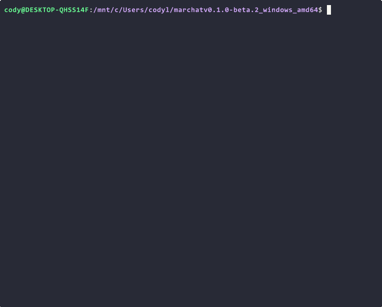
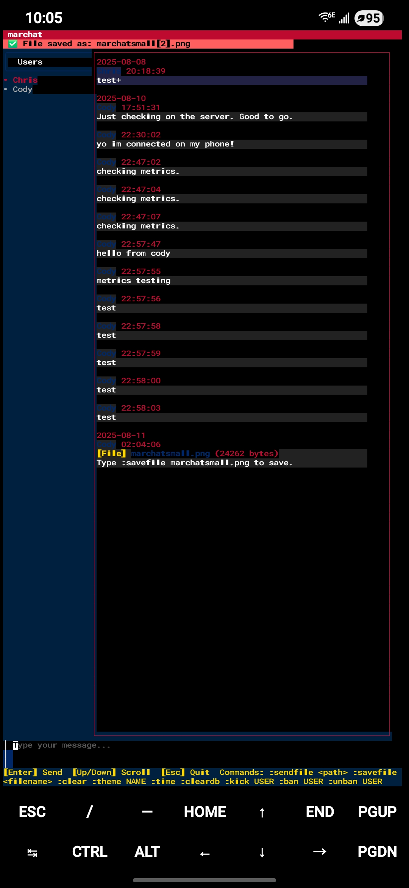
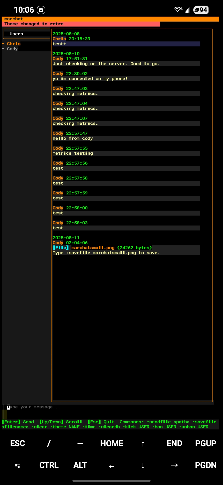

# marchat


[](https://github.com/Cod-e-Codes/marchat/actions/workflows/go.yml)
[](LICENSE)
[](https://github.com/Cod-e-Codes/marchat)
[](https://go.dev/dl/)
[](https://github.com/Cod-e-Codes/marchat/releases)
[](https://hub.docker.com/r/codecodesxyz/marchat)
[](https://selfh.st/weekly/2025-07-25/)
[](https://mtkblogs.com/2025/07/23/marchat-a-go-powered-terminal-chat-app-for-the-modern-user/)

A lightweight terminal chat with separate server and client binaries, real-time messaging over WebSockets, optional end-to-end encryption, and a flexible plugin ecosystem. Built for developers who prefer the command line and want reliable, self-hosted group chat with minimal operational overhead.




## Table of Contents  

- [Overview](#overview)
- [Features](#features)  
- [Database Schema](#database-schema)
- [Installation & Setup](#installation--setup)
  - [Binary Installation](#binary-installation)
  - [Docker Installation](#docker-installation)
  - [Source Installation](#source-installation)
- [Quick Start](#quick-start)  
- [Configuration](#configuration)
- [Admin Panel](#admin-panel)
- [TLS Support](#tls-support)
- [Plugin System](#plugin-system)
- [Ban History Gaps](#ban-history-gaps)
- [Usage](#usage)  
- [Security](#security)  
- [Troubleshooting](#troubleshooting)  
- [Roadmap](#roadmap)
- [Getting Help](#getting-help)
- [Contributing](#contributing)
- [Appreciation](#appreciation)

## Overview

marchat started as a fun weekend project for father-son coding sessions and has since evolved into a lightweight, self-hosted terminal chat application designed specifically for developers who love the command line. It currently runs with a local SQLite database and real-time messaging over WebSockets, with planned support for PostgreSQL and MySQL to enable greater scalability and flexibility.

**Key Benefits:**
- **Self-hosted**: No external services required
- **Cross-platform**: Runs on Linux, macOS, and Windows
- **Secure**: Optional E2E encryption with X25519/ChaCha20-Poly1305, including global encryption for public channels
- **Extensible**: Plugin ecosystem for custom functionality
- **Lightweight**: Minimal resource usage, perfect for servers

## Features

| Feature | Description |
|---------|-------------|
| **Terminal UI** | Beautiful TUI built with Bubble Tea |
| **Real-time Chat** | Fast WebSocket-based messaging with a lightweight SQLite backend |
| **Plugin System** | Install and manage plugins via remote registry with `:store` and `:plugin` commands |
| **E2E Encryption** | Optional X25519 key exchange with ChaCha20-Poly1305, global encryption for public channels |
| **File Sharing** | Send files up to 1MB with `:sendfile` |
| **Admin Controls** | User management, bans, and database operations with improved ban/unban experience |
| **Bell Notifications** | Audio alerts for new messages with `:bell` and `:bell-mention` commands |
| **Themes** | Choose from system (default), patriot, retro, or modern themes |
| **Docker Support** | Containerized deployment with security features |

| Cross-Platform File Sharing          | Theme Switching                         |
|------------------------------------|---------------------------------------|
|  |  |

*marchat running on Android via Termux, demonstrating file transfer through reverse proxy and real-time theme switching*

## Changelog

### v0.6.0-beta.3 (Upcoming)
- **Bell Notifications**: New `:bell` and `:bell-mention` commands for audio alerts with rate limiting and config persistence

### v0.6.0-beta.2 (Latest)
- **Server Admin Panel**: New `--admin-panel` flag enables built-in terminal admin panel with Ctrl+A hotkey access
- **Fixed Allow Command**: Resolved `:allow` command issues with E2E encryption by implementing hotkey alternatives
- **Key Binding Improvements**: Changed allow command hotkey from Ctrl+A to Ctrl+Shift+A to resolve conflicts
- **Enhanced Documentation**: Updated README with comprehensive admin panel documentation and E2E encryption notes

### v0.6.0-beta.1
- **Admin UI with Hotkeys**: New `:admin` command opens full-screen admin panel with hotkey navigation (Tab/Shift+Tab, Enter, Esc)
- **Code Snippet Interface**: New `:code` command opens syntax-highlighted code snippet composer with language selection and live preview
- **Enhanced Configuration System**: Improved interactive setup with connection profiles, auto-connect, and quick-start options
- **Optimized Performance**: Removed Glamour dependency for faster syntax highlighting using Chroma directly
- **Better User Experience**: Full-screen modals for admin and code features, improved navigation and error handling
- **Cross-Platform Improvements**: Better Windows compatibility and platform-appropriate configuration directories

### v0.5.0-beta.4
- **Stale Connection Management**: Automatic cleanup of dead connections every 5 minutes with WebSocket ping health checks
- **Enhanced Admin Commands**: Added `:cleanup` and `:forcedisconnect <username>` for manual stale connection removal
- **Restructured Moderation System**: `:ban` now permanent until unban, `:kick` for 24h temp ban, `:allow` to override kicks early
- **Admin-Only Plugin Installation**: Plugin installation now requires admin privileges for improved security
- **Windows Terminal Fix**: Fixed `--quick-start` flag freezing on Windows by implementing Bubble Tea UI for profile selection
- **Improved Documentation**: Comprehensive troubleshooting section and moderation system documentation

### v0.5.0-beta.3
- **Interactive Configuration UI**: Modern Bubble Tea-based form interface with styled colors, tab navigation, and real-time validation
- **System Theme as Default**: New "system" theme respects terminal colors for better accessibility and out-of-box experience
- **Duplicate Username Detection**: Intelligent error handling prevents connection loops when username is already taken
- **Simplified E2E Encryption**: Removed individual encryption complexity, now supports global encryption only for easier deployment
- **Enhanced User Experience**: Conditional field visibility, password masking, and helpful prompts in configuration UI
- **Connection Profile Management**: Save and manage multiple server connections with platform-appropriate storage
- **Quick Start Options**: `--auto` and `--quick-start` flags for instant connection to saved profiles
- **Improved Error Handling**: Clear error messages for duplicate usernames, connection failures, and configuration issues
- **Backward Compatibility**: All existing command-line flags continue to work as before

### v0.5.0-beta.2
- **Fixed Plugin Checksum Validation**: Corrected plugin installation checksum validation to properly validate downloaded ZIP files instead of extracted binaries
- **Enhanced Help System**: Improved help overlay formatting with better spacing and removed deprecated individual E2E encryption commands
- **Backward Compatibility**: Added keystore location compatibility for existing users while supporting platform-appropriate directories
- **Documentation Updates**: Removed individual E2E encryption references from README, focusing on global encryption only
- **Bug Fixes**: Fixed linting errors, capitalization issues, and improved overall code quality

## Database Schema

The database includes these key tables:
- **messages**: Core message storage with `message_id` for tracking
- **user_message_state**: Per-user message history state
- **ban_history**: Ban/unban event tracking for history gaps feature

## Installation & Setup

### Binary Installation

**Download pre-built binaries for v0.6.0-beta.2:**

```bash
# Linux (amd64)
wget https://github.com/Cod-e-Codes/marchat/releases/download/v0.6.0-beta.2/marchat-v0.6.0-beta.2-linux-amd64.zip
unzip marchat-v0.6.0-beta.2-linux-amd64.zip
chmod +x marchat-server marchat-client

# macOS (amd64)
wget https://github.com/Cod-e-Codes/marchat/releases/download/v0.6.0-beta.2/marchat-v0.6.0-beta.2-darwin-amd64.zip
unzip marchat-v0.6.0-beta.2-darwin-amd64.zip
chmod +x marchat-server marchat-client

# Windows
# Download from GitHub releases page, extract the ZIP,
# and run marchat-server.exe and marchat-client.exe from PowerShell or CMD.

# Android/Termux (arm64)
pkg install wget unzip
wget https://github.com/Cod-e-Codes/marchat/releases/download/v0.6.0-beta.2/marchat-v0.6.0-beta.2-android-arm64.zip
unzip marchat-v0.6.0-beta.2-android-arm64.zip
chmod +x marchat-server marchat-client

```

### Docker Installation

**Pull from Docker Hub:**

```bash
# Latest release
docker pull codecodesxyz/marchat:v0.6.0-beta.2

# Run with environment variables
docker run -d \
  -p 8080:8080 \
  -e MARCHAT_ADMIN_KEY=$(openssl rand -hex 32) \
  -e MARCHAT_USERS=admin1,admin2 \
  codecodesxyz/marchat:v0.6.0-beta.2
```

### Source Installation

**Prerequisites:**
- Go 1.23+ ([download](https://go.dev/dl/))
- For Linux clipboard support: `sudo apt install xclip` (Ubuntu/Debian) or `sudo yum install xclip` (RHEL/CentOS)

**Build from source:**

```bash
git clone https://github.com/Cod-e-Codes/marchat.git
cd marchat
go mod tidy
go build -o marchat-server ./cmd/server
go build -o marchat-client ./client
chmod +x marchat-server marchat-client
```

## Quick Start

### 1. (Recommended) Generate Secure Admin Key

For security, generate a strong random key to use as your admin key. This step is recommended but you can set any non-empty string as the admin key.

```bash
openssl rand -hex 32
```

### 2. Start Server

```bash
# Set environment variables
export MARCHAT_ADMIN_KEY="your-generated-key"
export MARCHAT_USERS="admin1,admin2"

# Start server
./marchat-server

# Or start with admin panel enabled
./marchat-server --admin-panel
```

### 3. Connect Client

```bash
# Connect as admin
./marchat-client --username admin1 --admin --admin-key your-generated-key --server ws://localhost:8080/ws

# Connect as regular user
./marchat-client --username user1 --server ws://localhost:8080/ws
```

## Configuration

### Environment Variables

| Variable | Required | Default | Description |
|----------|----------|---------|-------------|
| `MARCHAT_ADMIN_KEY` | Yes | - | Admin authentication key |
| `MARCHAT_USERS` | Yes | - | Comma-separated admin usernames |
| `MARCHAT_PORT` | No | `8080` | Server port |
| `MARCHAT_DB_PATH` | No | `./config/marchat.db` | Database file path |
| `MARCHAT_LOG_LEVEL` | No | `info` | Log level (debug, info, warn, error) |
| `MARCHAT_CONFIG_DIR` | No | Auto-detected | Custom config directory |
| `MARCHAT_TLS_CERT_FILE` | No | - | Path to TLS certificate file |
| `MARCHAT_TLS_KEY_FILE` | No | - | Path to TLS private key file |
| `MARCHAT_BAN_HISTORY_GAPS` | No | `true` | Enable ban history gaps (prevents banned users from seeing messages during ban periods) |
| `MARCHAT_PLUGIN_REGISTRY_URL` | No | GitHub registry | URL for plugin registry (default: https://raw.githubusercontent.com/Cod-e-Codes/marchat-plugins/main/registry.json) |
| `MARCHAT_GLOBAL_E2E_KEY` | No | - | Base64-encoded 32-byte global encryption key for public channels |

### Configuration File

Create `config.json` for client configuration:

```json
{
  "username": "your-username",
  "server_url": "ws://localhost:8080/ws",
  "theme": "system",
  "twenty_four_hour": true
}
```

## Admin Panel

marchat includes a built-in terminal-based admin panel that provides a comprehensive interface for server management. The admin panel allows you to monitor server statistics, manage users, configure plugins, and perform administrative tasks directly from the terminal.

### Enabling the Admin Panel

Start the server with the `--admin-panel` flag to enable the admin panel:

```bash
./marchat-server --admin-panel
```

When the admin panel is enabled, you'll see an additional message in the server startup banner:
```
🖥️ Admin Panel: Press Ctrl+A to open admin panel, Ctrl+C to shutdown
```

### Using the Admin Panel

Once the server is running with the admin panel enabled:

1. **Open Admin Panel**: Press `Ctrl+A` to launch the admin panel interface
2. **Navigate**: Use arrow keys to navigate through different sections
3. **Exit**: Press `q` or `Esc` to return to the server console
4. **Shutdown**: Press `Ctrl+C` to gracefully shutdown the server

### Admin Panel Features

The admin panel provides access to:

- **Server Statistics**: Real-time monitoring of connected users, message counts, and system performance
- **User Management**: View connected users, manage bans, and handle user permissions
- **Plugin Management**: Install, configure, and manage server plugins
- **System Configuration**: View and modify server settings
- **Database Management**: Access database statistics and perform maintenance tasks

### Requirements

- The admin panel requires a terminal environment (stdin must be a terminal)
- If running in a non-terminal environment (like systemd services), the admin panel will be automatically disabled with a warning message
- The admin panel uses terminal raw mode for hotkey detection, which is automatically restored when exiting

## TLS Support

TLS (Transport Layer Security) enables secure WebSocket connections using `wss://` instead of `ws://`. This is essential for production deployments and when exposing the server over the internet.

### When to Use TLS

- **Public deployments**: When the server is accessible from the internet
- **Production environments**: For enhanced security and privacy
- **Corporate networks**: When required by security policies
- **HTTPS reverse proxies**: When behind nginx, traefik, or similar

### Enabling TLS

TLS is optional but recommended for secure deployments. To enable TLS:

1. **Obtain SSL/TLS certificates** (self-signed for testing, CA-signed for production)
2. **Set environment variables**:
   ```bash
   export MARCHAT_TLS_CERT_FILE="/path/to/cert.pem"
   export MARCHAT_TLS_KEY_FILE="/path/to/key.pem"
   ```
3. **Start the server** - it will automatically detect TLS configuration

### Example Configuration

**With TLS (recommended for production):**
```bash
# Generate self-signed certificate for testing
openssl req -x509 -newkey rsa:4096 -keyout key.pem -out cert.pem -days 365 -nodes

# Set environment variables
export MARCHAT_ADMIN_KEY="your-secure-key"
export MARCHAT_USERS="admin1,admin2"
export MARCHAT_TLS_CERT_FILE="./cert.pem"
export MARCHAT_TLS_KEY_FILE="./key.pem"

# Start server (will show wss:// in banner)
./marchat-server
```

**Without TLS (development/testing):**
```bash
# No TLS certificates set
export MARCHAT_ADMIN_KEY="your-secure-key"
export MARCHAT_USERS="admin1,admin2"

# Start server (will show ws:// in banner)
./marchat-server
```

### Client Connection

The client connection URL automatically reflects the server's TLS status:

- **TLS enabled**: Connect to `wss://host:port/ws`
- **TLS disabled**: Connect to `ws://host:port/ws`

The server banner displays the correct WebSocket URL scheme based on TLS configuration.

### TLS Verification Bypass

For development and testing with self-signed certificates, you can bypass TLS verification:

```bash
# Connect with TLS verification bypass
./marchat-client --skip-tls-verify --server wss://localhost:8080/ws

# Regular connection (with verification)
./marchat-client --server wss://localhost:8080/ws
```

> [!WARNING]
> **Security Warning**: Use `--skip-tls-verify` only for development and testing. Production deployments should use valid TLS certificates.

## Plugin System

The plugin system allows you to extend marchat's functionality with custom commands and features. Plugins are automatically downloaded from the configured registry.

### Plugin Registry

By default, marchat uses the GitHub plugin registry. You can configure a custom registry:

```bash
# Use default GitHub registry
export MARCHAT_PLUGIN_REGISTRY_URL="https://raw.githubusercontent.com/Cod-e-Codes/marchat-plugins/main/registry.json"

# Use custom registry
export MARCHAT_PLUGIN_REGISTRY_URL="https://my-registry.com/plugins.json"
```

### Plugin Commands

| Command | Description | Example |
|---------|-------------|---------|
| `:store` | Browse available plugins | `:store` |
| `:plugin install <name>` | Install a plugin | `:plugin install echo` |
| `:plugin uninstall <name>` | Remove a plugin | `:plugin uninstall echo` |
| `:plugin list` | List installed plugins | `:plugin list` |

### Available Plugins

- **Echo**: Simple echo plugin for testing

## Ban History Gaps

The ban history gaps feature prevents banned users from seeing messages that were sent during their ban periods. This creates a more effective moderation experience by ensuring users cannot access conversation history from when they were excluded from the chat.

### How It Works

When enabled, the system:
1. **Tracks ban events** in a dedicated `ban_history` table
2. **Records ban/unban timestamps** with admin attribution
3. **Filters message history** for users with ban records
4. **Maintains performance** by only filtering for users who have been banned

### Enabling Ban History Gaps

Set the environment variable to enable this feature:

```bash
# Enable ban history gaps (enabled by default)
export MARCHAT_BAN_HISTORY_GAPS=true

# Start server with feature enabled
./marchat-server
```

### Behavior Examples

**With Ban History Gaps Enabled:**
- User gets banned → cannot see new messages
- User gets unbanned → reconnects and sees only messages sent after their unban
- Messages sent during ban period are permanently hidden from that user

**With Ban History Gaps Disabled:**
- User gets banned → cannot see new messages
- User gets unbanned → reconnects and sees all messages (including those sent during ban)

## Usage

### Keyboard Shortcuts

| Shortcut | Description |
|----------|-------------|
| `Ctrl+H` | Toggle help overlay with all commands and shortcuts |
| `Enter` | Send message |
| `Esc` | Quit application |
| `↑/↓` | Scroll through chat history |
| `PgUp/PgDn` | Page through chat history |
| `Ctrl+C/V/X` | Copy/Paste/Cut text |
| `Ctrl+A` | Select all text |

**Tip:** Press `Ctrl+H` to see the complete help overlay with all available commands!

### Themes

marchat supports multiple visual themes to customize your chat experience:

| Theme | Description | Best For |
|-------|-------------|----------|
| **system** *(default)* | Minimal styling that respects your terminal's color scheme | Users who prefer their terminal theme, accessibility, high contrast |
| **patriot** | Red, white, and blue color scheme | American patriotic theme |
| **retro** | Orange and green retro terminal colors | Classic terminal/hacker aesthetic |
| **modern** | Blue and gray modern design | Clean, professional appearance |

**Changing Themes:**
- **During setup**: Interactive configuration will prompt for theme selection
- **Runtime**: Use `:theme <name>` command (e.g., `:theme system`)
- **Config file**: Set `"theme": "system"` in your `config.json`
- **Command line**: Use `--theme system` flag

The **system** theme is the default because it respects your terminal's existing color configuration, ensuring accessibility and preventing color conflicts.

### Bell Notifications

marchat includes audio notification support to alert you when new messages arrive:

| Setting | Description | Default |
|---------|-------------|---------|
| **Bell Enabled** | Play audio alert for all new messages | `false` |
| **Bell on Mention Only** | Only play bell when mentioned with `@username` | `false` |

**Bell Commands:**
- `:bell` - Toggle bell notifications on/off
- `:bell-mention` - Toggle bell only on mentions mode

**How it works:**
- Uses the ASCII bell character (`\a`) which works on most terminal emulators
- Includes rate limiting (500ms minimum between bells) to prevent spam
- Respects your terminal's volume settings
- Automatically saves your preferences to the config file

**Configuration:**
- **Runtime**: Use `:bell` and `:bell-mention` commands
- **Config file**: Set `"enable_bell": true` and `"bell_on_mention": false` in your `config.json`

### Basic Commands

| Command | Description | Example |
|---------|-------------|---------|
| `:theme <name>` | Switch theme | `:theme system` |
| `:time` | Toggle 12/24-hour format | `:time` |
| `:clear` | Clear chat buffer | `:clear` |
| `:sendfile <path>` | Send file (<1MB) | `:sendfile document.txt` |
| `:savefile <name>` | Save received file | `:savefile received.txt` |
| `:code` | Open code snippet composer | `:code` |
| `:bell` | Toggle message bell notifications | `:bell` |
| `:bell-mention` | Toggle bell only on mentions | `:bell-mention` |
| `:admin` | Open admin panel (admin only) | `:admin` |

### Plugin Commands

| Command | Description | Admin Only |
|---------|-------------|------------|
| `:store` | Open plugin store | No |
| `:plugin list` | List installed plugins | No |
| `:plugin install <name>` | Install plugin | Yes |
| `:plugin uninstall <name>` | Uninstall plugin | Yes |

### Admin Commands

| Command | Description | Example |
|---------|-------------|---------|
| `:cleardb` | Wipe server database | `:cleardb` |
| `:kick <username>` | Kick user (24h temporary ban) | `:kick user1` |
| `:ban <username>` | Ban user (permanent until unban) | `:ban user1` |
| `:unban <username>` | Remove permanent ban | `:unban user1` |
| `:allow <username>` | Override kick early (allow back) | `:allow user1` or `Ctrl+Shift+A` |
| `:cleanup` | Clean up stale connections | `:cleanup` |
| `:forcedisconnect <username>` | Force disconnect user (for stale connections) | `:forcedisconnect user1` |

**Connect as admin:**
```bash
./marchat-client --username admin1 --admin --admin-key your-key --server ws://localhost:8080/ws
```

**Note:** When E2E encryption is enabled, admin commands typed in chat (like `:allow username`) will be encrypted and won't work. Use the hotkey alternatives instead (e.g., `Ctrl+Shift+A` for allow command).

### Moderation System

marchat uses a two-tier moderation system designed for flexibility and clarity:

**Temporary Kicks (24 hours):**
- Use `:kick <username>` for temporary discipline
- User is automatically allowed back after 24 hours
- Can be overridden early with `:allow <username>`
- Ideal for cooling-off periods or minor infractions

**Permanent Bans (indefinite):**
- Use `:ban <username>` for serious violations
- User remains banned until manually unbanned
- Only removed with `:unban <username>`
- Ideal for persistent troublemakers or severe violations

**Override Commands:**
- `:allow <username>` - Let kicked users back early
- `:unban <username>` - Remove permanent bans
- Both commands restore clean message history for the user

## Client Configuration

marchat offers multiple ways to configure and connect to servers, from interactive setup for new users to quick-start options for returning users.

### Interactive Configuration (Default)

When you run the client without sufficient flags, it enters interactive configuration mode:

```bash
./marchat-client
```

The interactive mode guides you through:
- Server URL selection
- Username setup  
- Admin privileges configuration
- End-to-end encryption setup
- Theme selection
- Profile saving for future use

### Quick Start Options

For returning users, marchat provides convenient quick-start options:

```bash
# Auto-connect to most recently used profile
./marchat-client --auto

# Select from saved connection profiles
./marchat-client --quick-start
```

### Connection Profiles

The client automatically saves connection profiles in platform-appropriate locations:
- **Windows**: `%APPDATA%\marchat\profiles.json`
- **macOS**: `~/Library/Application Support/marchat/profiles.json`  
- **Linux**: `~/.config/marchat/profiles.json`

Profiles store non-sensitive connection settings like server URL, username, and preferences. Sensitive data (admin keys, keystore passphrases) are prompted for each session.

### Traditional Flag-Based Configuration

For automation and scripts, you can still use traditional command-line flags:

```bash
# Basic connection
./marchat-client --server ws://localhost:8080/ws --username alice

# Admin connection
./marchat-client --server ws://localhost:8080/ws --username admin --admin --admin-key your-key

# E2E encrypted connection
./marchat-client --server ws://localhost:8080/ws --username alice --e2e --keystore-passphrase your-passphrase

# Non-interactive mode (requires all necessary flags)
./marchat-client --non-interactive --server ws://localhost:8080/ws --username alice
```

### E2E Encryption

marchat uses **global E2E encryption** for secure group chat. Individual user-to-user encryption has been simplified in favor of a shared global encryption model that's easier to use and manage.

**Enable E2E encryption:**
```bash
./marchat-client --e2e --keystore-passphrase your-passphrase --username alice --server ws://localhost:8080/ws
```

### Global E2E Encryption

marchat supports global E2E encryption for public channels, allowing secure group chat. This feature uses a shared global encryption key that all clients can use to encrypt and decrypt messages in public channels.

#### How Global E2E Works

- **Shared Key**: All clients use the same global encryption key for public channels
- **Simple Setup**: Shared key model eliminates complex key management
- **Environment Variable**: Set `MARCHAT_GLOBAL_E2E_KEY` to share the same key across clients
- **Automatic Generation**: If no global key is provided, a new one is generated and displayed

#### Setting Up Global E2E Encryption

**Option 1: Use Environment Variable (Recommended for shared deployments)**
```bash
# Generate a 32-byte key and encode as base64
openssl rand -base64 32

# Set the environment variable with the generated key
export MARCHAT_GLOBAL_E2E_KEY="your-generated-base64-key"

# Run client with E2E enabled
./marchat-client --e2e --keystore-passphrase your-passphrase --username alice --server ws://localhost:8080/ws
```

**Option 2: Let marchat Generate a Key**
```bash
# Run client without environment variable - marchat will generate a new key
./marchat-client --e2e --keystore-passphrase your-passphrase --username alice --server ws://localhost:8080/ws

# The client will display the generated key:
# 🔐 Generated new global E2E key (ID: RsLi9ON0ZYvEPOmyMs1IhWL5vPTGEfamExCPuaESV7M=)
# 💡 Set MARCHAT_GLOBAL_E2E_KEY=fF+HkmGArkPNsdb+M+qj/JgBmCTV8R0J7zEW80Izjtw= to share this key across clients
```

#### Sharing the Global Key

To enable multiple clients to communicate securely, share the global key:

1. **Copy the generated key** from the client output
2. **Set the environment variable** on all client machines:
   ```bash
   export MARCHAT_GLOBAL_E2E_KEY="fF+HkmGArkPNsdb+M+qj/JgBmCTV8R0J7zEW80Izjtw="
   ```
3. **Run all clients** with the same global key

#### Expected Output

When global E2E is working correctly, you'll see:
```
🔐 Using global E2E key from environment variable
🌐 Global chat encryption: ENABLED (Key ID: RsLi9ON0ZYvEPOmyMs1IhWL5vPTGEfamExCPuaESV7M=)
✅ Encryption validation passed
🔐 E2E encryption enabled with keystore: config/keystore.dat
```

## Security

### Critical Security Warnings

> [!WARNING]
> Change default admin key immediately
>  The default admin key `changeme` is insecure. Generate a secure key:
```bash
openssl rand -hex 32
```

### Security Best Practices

1. **Generate Secure Keys:**
   ```bash
   # Admin key
   openssl rand -hex 32
   
   # JWT secret (optional)
   openssl rand -base64 32
   ```

2. **Secure File Permissions:**
   ```bash
   # Secure database file
   chmod 600 ./config/marchat.db
   
   # Secure config directory
   chmod 700 ./config
   ```

3. **Production Deployment:**
   - Use `wss://` for secure WebSocket connections
   - Implement reverse proxy (nginx/traefik)
   - Restrict server access to trusted networks
   - Use Docker secrets for sensitive environment variables

### E2E Encryption

When enabled, E2E encryption provides:
- **Forward Secrecy**: Unique session keys per conversation
- **Server Privacy**: Server cannot read encrypted messages
- **Key Management**: Local encrypted keystore with passphrase protection
- **Global Encryption**: Shared global key for public channel encryption

## Troubleshooting

### Common Issues

| Issue | Solution |
|-------|----------|
| **Connection failed** | Verify server URL uses `ws://` or `wss://` |
| **TLS certificate errors** | Ensure certificate and key files are readable and valid |
| **Admin commands not working** | Ensure `--admin` flag and correct `--admin-key` |
| **Clipboard not working (Linux)** | Install `xclip`: `sudo apt install xclip` |
| **Permission denied (Docker)** | Rebuild with correct UID/GID: `docker-compose build --build-arg USER_ID=$(id -u)` |
| **Port already in use** | Change port: `export MARCHAT_PORT=8081` |
| **Database migration fails** | Ensure proper database file permissions and backup before building from source |
| **Message history missing after update** | Expected behavior - user message states reset for improved ban/unban experience |
| **Server fails to start after source build** | Check database permissions - migrations are automatic |
| **Ban history gaps not working** | Ensure `MARCHAT_BAN_HISTORY_GAPS=true` is set (default) and database has `ban_history` table |
| **TLS certificate errors** | Use `--skip-tls-verify` flag for development with self-signed certificates |
| **Plugin installation fails** | Check `MARCHAT_PLUGIN_REGISTRY_URL` is accessible and registry format is valid |
| **E2E encryption not working** | Ensure `--e2e` flag is used and keystore passphrase is provided. Check debug logs for detailed error messages |
| **Global E2E key not working** | Verify `MARCHAT_GLOBAL_E2E_KEY` is set correctly and is a valid base64-encoded 32-byte key. Use `openssl rand -base64 32` to generate a valid key |
| **"no session key found for global" error** | Fixed in latest version - global E2E key support automatically handles this error |
| **Blank encrypted messages** | Fixed in v0.3.0-beta.5 - ensure you're using the latest version and have added recipient public keys with `:addkey` |
| **E2E startup failures** | Fixed in v0.3.0-beta.6 - "conversation: test" session key issue resolved |
| **Username already taken** | If you disconnected ungracefully (Ctrl+C), use admin `:forcedisconnect <username>` to remove stale connection |
| **Stale connections preventing login** | Server automatically cleans up dead connections every 5 minutes, or use admin `:cleanup` command |
| **Client frozen during startup** | Fixed in latest version - `--quick-start` flag now uses proper UI instead of console input |

### Stale Connection Management

marchat includes robust stale connection cleanup to prevent "username already taken" errors when clients disconnect ungracefully.

**Automatic Cleanup:**
- Server automatically detects and removes stale connections every 5 minutes
- Uses WebSocket ping messages to identify broken connections
- No manual intervention required for most cases

**Manual Cleanup (Admin Commands):**
```bash
# Clean up all stale connections immediately
:cleanup

# Force disconnect a specific user (useful for your own stale connection)
:forcedisconnect username

# Example: Remove your own stale connection after ungraceful disconnect
:forcedisconnect myusername
```

**Common Scenarios:**
1. **Client crashes or Ctrl+C**: Server detects within 5 minutes and cleans up automatically
2. **Network interruption**: Stale connection removed on next cleanup cycle
3. **Immediate reconnection needed**: Admin can use `:forcedisconnect` for instant cleanup
4. **Multiple stale connections**: Use `:cleanup` to remove all dead connections at once

### Network Connectivity

**Local Network:**
```bash
# Ensure server binds to all interfaces
export MARCHAT_PORT=8080
./marchat-server
```

## Roadmap  

See the [project roadmap](ROADMAP.md) for planned features, performance enhancements, and future development goals.

## Getting Help

- **GitHub Issues**: [Report bugs](https://github.com/Cod-e-Codes/marchat/issues)
- **GitHub Discussions**: [Ask questions](https://github.com/Cod-e-Codes/marchat/discussions)
- **Documentation**: [Plugin Ecosystem](PLUGIN_ECOSYSTEM.md)
- **Security**: [Security Policy](SECURITY.md)

## Contributing

We welcome contributions! See the [contribution guidelines](CONTRIBUTING.md) for:
- Development setup
- Code style guidelines
- Pull request process

**Quick Start for Contributors:**
```bash
git clone https://github.com/Cod-e-Codes/marchat.git
cd marchat
go mod tidy
go test ./...
```

---

## Appreciation

Special thanks to these wonderful communities and bloggers for featuring and supporting **marchat**:

- [Self-Host Weekly](https://selfh.st/weekly/2025-07-25/) by Ethan Sholly  
- [mtkblogs.com](https://mtkblogs.com/2025/07/23/marchat-a-go-powered-terminal-chat-app-for-the-modern-user/) by Reggie  

For a full list of contributors, see [CONTRIBUTORS.md](CONTRIBUTORS.md).

---

**License**: [MIT License](LICENSE)

**Commercial Support**: Contact [cod.e.codes.dev@gmail.com](mailto:cod.e.codes.dev@gmail.com)
